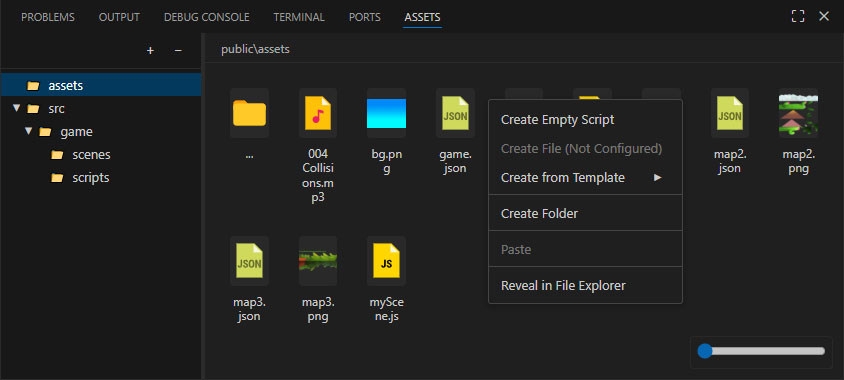
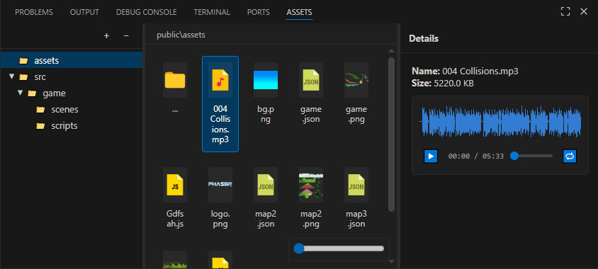
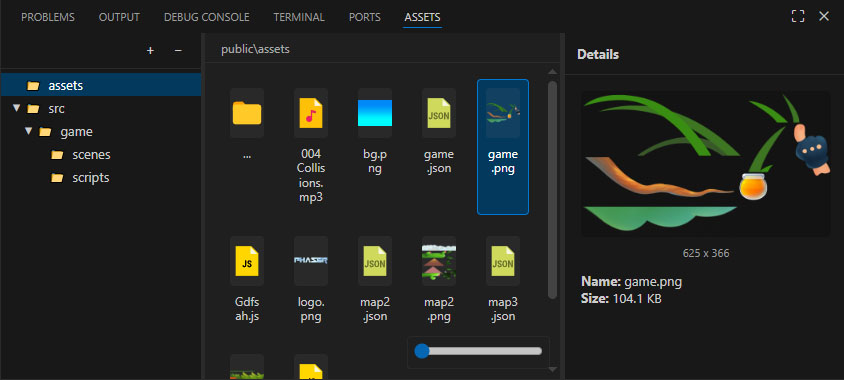

# Assets Manager for VS Code

**Assets Manager** is a powerful productivity tool designed for game developers (Phaser, WebGL) and web designers. It provides a visual interface to manage your project assets, preview media files, and generate code snippets directly within VS Code.


<!-- Добавьте скриншот общего вида расширения в папку images в корне проекта -->

## ✨ Features

### 📂 Visual File Management
- **Split View:** Navigate folders using a Tree View on the left and a Grid Gallery on the right.
- **Drag & Drop:** Move files and folders effortlessly within the manager.
- **File Operations:** Create folders, rename, delete, cut, copy, and paste files via context menu or hotkeys.
- **Expand/Collapse All:** Quickly manage tree visibility with dedicated controls.

### 🎧 Media Preview
- **Audio Player:** Built-in player for audio files (`.mp3`, `.ogg`, `.wav`) with **waveform visualization**, looping, and playback speed control.
- **Image Preview:** Instant preview for images (`.png`, `.jpg`, `.svg`, etc.) with dimension details.




### ⚡ Smart Templates & Scripting
- **One-Click Script Creation:** Configure your preferred extension (`.js`, `.ts`, `.lua`, etc.) and create empty scripts instantly.
- **Context-Aware Scenarios:** Define a main "Scene Template" (e.g., for Phaser Scenes or Unity Scripts).
  - If the template contains a special key (e.g., `{{myKey}}`), the extension prompts for a name and automatically replaces the key inside the file.
  - If no key is found, it instantly creates the file using the template name.
- **Template Library:** Access a folder of multiple templates directly from the context menu.

### 🛠️ Developer Tools
- **Import Helper:** Right-click a script or asset to insert an `import` statement into your active code editor.
- **Copy Utilities:** Copy relative paths or asset keys (filenames without extensions) to the clipboard.

---

## 🚀 Getting Started

1. Install the extension.
2. Open the **Assets Manager** tab in the Activity Bar.
3. **Configure your root folders** in settings to start seeing your assets.

---

## ⚙️ Configuration

You can configure the extension via **File > Preferences > Settings** (search for `Assets Manager`).

| Setting | Default | Description |
| :--- | :--- | :--- |
| `assetsManager.rootFolders` | `[]` | **Required.** List of folder paths (relative to workspace root) to display in the view (e.g., `["src", "public/assets"]`). |
| `assetsManager.newScriptExtension` | `"js"` | Extension for new empty scripts (e.g., `ts`, `cs`, `json`). |
| `assetsManager.fileTemplatePath` | `""` | Path to a specific template file. Adds a "Create [TemplateName]" item to the context menu. |
| `assetsManager.templatesPath` | `"templates"` | Path to a folder containing multiple template files. |
| `assetsManager.enableTemplateReplacement`| `true` | If enabled, prompts for a name when creating from a template containing the replacement key. |
| `assetsManager.templateReplacementKey` | `{{myKey}}` | The string to replace in templates (e.g., `{{className}}`). |
| `assetsManager.copyKeyIncludeExtension` | `false` | If true, "Copy Key" includes the file extension. |

---

## 📝 Template System Guide

### 1. The "Quick Create" Template
Set `assetsManager.fileTemplatePath` to a specific file, e.g., `templates/SceneTemplate.ts`.

**Scenario A: Auto-Naming**
*   Your template file **does not** contain `{{myKey}}`.
*   Right-click in the panel -> Select **"Create SceneTemplate"**.
*   Result: A new file `SceneTemplate.ts` (or `SceneTemplate1.ts`) is created instantly.

**Scenario B: Smart Renaming**
*   Your template file looks like this:
    ```typescript
    export class {{myKey}} extends Phaser.Scene { ... }
    ```
*   Right-click -> Select **"Create SceneTemplate"**.
*   Input prompt appears. You type: `LevelOne`.
*   Result: `LevelOne.ts` is created, and the code becomes `export class LevelOne extends ...`.

### 2. General Templates Folder
Put any number of files in the folder defined in `assetsManager.templatesPath`. They will appear in the **"Create from Template >"** submenu.

---

## ⌨️ Shortcuts

| Key | Action |
| :--- | :--- |
| `Ctrl+C` | Copy file |
| `Ctrl+X` | Cut file |
| `Ctrl+V` | Paste file |

---

## 🐛 Known Issues

Please report any bugs or feature requests on the [GitHub Issues](https://github.com/Qugurun/assets-manager/issues) page.

---

**Enjoy making games!**